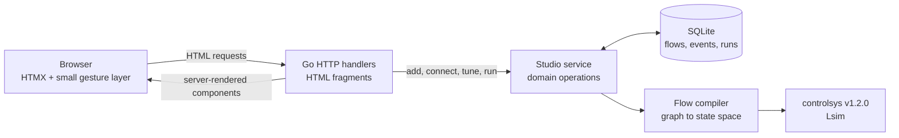

# Process Lab

Process Lab is a runnable demonstration of a Go + HTMX + SQLite application with a frontend that behaves like a small engineering desktop tool. Users build a dynamic process flowsheet, connect signal blocks, tune parameters, drag blocks around the canvas, and simulate the result without a frontend framework or JSON API.

The seeded example models two first-order paths feeding an energy balance:

- a setpoint through valve gain and reactor dynamics;
- a disturbance through jacket dynamics and heat loss;
- a summed temperature output rendered as an SVG trend.

The expected steady-state value is `1.8 + (0.3 × -0.7) = 1.59`, which is also asserted by the simulation tests.

## Run it

Requirements:

- Go 1.26.3 or newer
- an internet connection for the pinned HTMX 2.0.10 CDN script

```bash
go run ./cmd/processlab
```

Open [http://127.0.0.1:8080](http://127.0.0.1:8080). The first run creates `processlab.db` and seeds the reactor example.

To use another address or database:

```bash
go run ./cmd/processlab -addr 127.0.0.1:9090 -db ./demo.db
```

All CSS, application JavaScript, and HTML templates are embedded in the Go binary. Only HTMX itself is loaded from the pinned CDN URL.

## Try the workbench

1. Run the seeded model and inspect the temperature response and settling metric.
2. Right-click empty canvas and add a block; it lands where you clicked.
3. Drag from an orange output port to a gray input port to wire a signal.
4. Click a block to edit its name or numerical parameter in the inspector.
5. Drag a block. It snaps to the grid and shows guides when it lines up with a neighbour.
6. Drag a box around several blocks and move them together.
7. Collapse the side rails and drag the dock down to give the sheet the whole window.

Press `?` for the full shortcut sheet.

## Workbench interaction

The window is a fixed application shell: the page itself never scrolls, and
the canvas is the only region that grows. Both side rails collapse to a
46px icon strip — the collapsed library still adds blocks — and the
simulation dock at the bottom drags between a header-only state and 70% of
the window. Those choices persist across reloads.

The sheet is a 6000×4000 world on a 20px grid, viewed through a pan/zoom
viewport at 25%–400%.

| Gesture | Action |
| --- | --- |
| Wheel | Pan |
| `Cmd`/`Ctrl` + wheel, or pinch | Zoom about the pointer |
| Space + drag, or middle-drag | Pan |
| Drag empty canvas | Select blocks with a marquee (`Shift` extends) |
| Drag a block | Move it, snapped to the grid; moves the whole selection |
| `Alt` + drag | Suspend alignment magnetism (still snaps to the grid) |
| Drag port to port | Wire a signal |
| Click output, then input | Wire without dragging |
| Right-click | Context menu on a block or on the canvas |

| Keys | Action |
| --- | --- |
| `Delete` / `Backspace` | Delete the selection |
| Arrows / `Shift` + arrows | Nudge one / five grid steps |
| `Cmd`/`Ctrl` + `A` | Select every block |
| `Cmd`/`Ctrl` + `D` | Duplicate (wiring between blocks is not copied) |
| `Cmd`/`Ctrl` + `=` / `−` / `0` | Zoom in / out / reset |
| `Shift` + `1` | Fit the flowsheet to the window |
| `Esc` | Cancel wiring, or clear the selection |
| `Cmd`/`Ctrl` + `Enter` | Run the model |
| `?` | Shortcut sheet |

The status bar is a live readout rail: cursor position in sheet
coordinates, zoom, grid pitch, selection count, block and signal counts,
and solver state.

`docs/workbench-ergonomics.md` records the interaction model, the state
that lives on the client, and the constraints behind these choices.

## Stack and request flow



HTMX performs every server mutation and swaps the returned `#workbench` fragment. A small framework-free JavaScript file handles only interactions that must stay in the browser: the pan/zoom viewport, pointer dragging and grid snapping, marquee selection, provisional signal lines, port gestures, context menus, and keyboard shortcuts. Every mutation still persists through `htmx.ajax`.

Because the swap replaces the whole fragment, all client-held state — viewport, selection, rail and dock sizing — is re-applied after each swap and stored in `localStorage` rather than in the flow record. Multi-selection is deliberately client-side, so the server keeps its single `selected` parameter for the inspector and a marquee costs no round trips.

The Go handlers state user intent and call one cohesive service operation. They do not coordinate SQL transactions or simulation steps. The `studio` package owns block defaults, validation, placement, cycle detection, persistence, graph compilation, simulation, and stale-result rules.

## Supported blocks

| Library | Block | Behavior | Input rule |
| --- | --- | --- | --- |
| Sources | Step | Configurable initial value, final value, and step time | No input |
| Sources | Constant | Constant signal | No input |
| Sources | Sine Wave | Biased sinusoid with amplitude, angular frequency, and phase | No input |
| Math | Gain | Multiplies its input by `K` | Exactly one |
| Math | Sum | Adds or subtracts inputs using a `+`/`-` sign pattern | One or more |
| Continuous | First-order Lag | `1 / (τs + 1)` | Exactly one |
| Continuous | Integrator | `1 / s` with zero initial condition | Exactly one |
| Continuous | Transfer Function | Proper continuous SISO numerator/denominator model | Exactly one |
| Continuous | PID Controller | Parallel PID with a required derivative filter time | Exactly one |
| Continuous | Transport Delay | Continuous delay represented by a selectable Padé order | Exactly one |
| Sinks | Scope | Plots the time-domain signal and response metrics | Exactly one |
| Sinks | Spectrum Analyzer | Hann-windowed one-sided amplitude spectrum using Gonum FFT | Exactly one |

Flows may branch and merge. Cycles are rejected because this version compiles an acyclic signal graph. Every source owns a separate external input channel, so Step, Constant, and Sine Wave blocks remain independent when a model branches or merges.

Each math or continuous block becomes a locally named `controlsys.System`. `controlsys.ConnectByName` composes those realizations into one state-space model, and `controlsys.Lsim` evaluates it on the requested time grid. Spectrum Analyzer sinks then apply Gonum's Hann window and real FFT to their selected response.

The linear boundary is deliberate. State-Space is deferred until the editor supports matrices and MIMO ports. Unit Delay and discrete filters require an explicit mixed-sample-time policy. Product, Saturation, Switch, Relay, and logic blocks require a nonlinear or hybrid solver; this compiler does not silently linearize them.

The module pins `github.com/jamestjsp/controlsys` to `v1.2.0` and includes the Gonum fork replacement required by that package.

## SQLite data

The database stores:

- flows and separate layout/model update timestamps;
- blocks, positions, and version-tolerant JSON parameters;
- signal connections with foreign keys and uniqueness constraints;
- recent activity events;
- complete simulation runs as JSON time series.

Model edits invalidate the displayed result, while layout-only moves do not. Historical runs remain in SQLite. Schema startup migrates databases created before model timestamps or JSON block parameters were introduced.

## Project structure

```text
cmd/processlab/           executable and graceful HTTP shutdown
internal/studio/          domain, SQLite repository, compiler, simulation
internal/web/             handlers, view models, embedded templates and assets
docs/                     block library and workbench interaction notes
.ergo/plans.jsonl         dependency-ordered implementation history
```

## Validate it

```bash
gofmt -w cmd internal
go vet ./...
go test -race ./...
go build ./cmd/processlab
```

The persistent tests cover SQLite round trips and legacy migration, grid snapping and the sheet bounds, collision-free block placement, connection constraints, cycle rejection, analytic control-block responses, FFT peak detection, HTML fragment behavior, embedded assets, multi-field HTTP editing flows, and the batch move, delete, and duplicate endpoints including rejection of ids from another flow.

Interaction behavior cannot be covered by Go tests. It was verified by driving real pointer and key gestures against headless Chrome over CDP — 88 checks across viewport, snapping, selection, keyboard, context menus, and wiring — at 25%, 100%, and 400% zoom, plus rendering at 1440×900, 1280×720, 860px, and 620px.

Note that templates and static assets are `go:embed`-ed into the binary, so a change to `app.js` or `app.css` needs a rebuild before the server serves it.
