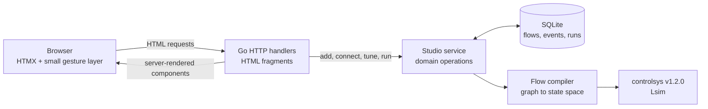

# Process Lab

Process Lab is a runnable demonstration of a Go + HTMX + SQLite application with a frontend that behaves like a small engineering desktop tool. Users build a dynamic process flowsheet, connect signal blocks, tune parameters, drag blocks around the canvas, and simulate the result without a frontend framework or JSON API.

The seeded example models two first-order paths feeding an energy balance:

- a setpoint through valve gain and reactor dynamics;
- a disturbance through jacket dynamics and heat loss;
- a summed temperature output rendered as an SVG trend.

The expected steady-state value is `1.8 + (0.3 × -0.7) = 1.59`, which is also asserted by the simulation tests.

## Run it

Requirements:

- Go 1.26.3 or newer
- an internet connection for the pinned HTMX 2.0.10 CDN script

```bash
go run ./cmd/processlab
```

Open [http://127.0.0.1:8080](http://127.0.0.1:8080). The first run creates `processlab.db` and seeds the reactor example.

To use another address or database:

```bash
go run ./cmd/processlab -addr 127.0.0.1:9090 -db ./demo.db
```

All CSS, application JavaScript, and HTML templates are embedded in the Go binary. Only HTMX itself is loaded from the pinned CDN URL.

## Try the workbench

1. Run the seeded model and inspect the temperature response and settling metric.
2. Add a block from the library. The server finds an open position for it.
3. Click an orange output port and then a gray input port to create a signal.
4. Click a block to edit its name or numerical parameter in the inspector.
5. Drag a block and refresh the page to confirm its position persisted.
6. Remove a signal from the inspector or delete its selected block.

Press `Esc` to cancel a pending signal wire and `Cmd+Enter` or `Ctrl+Enter` to run the model.

## Stack and request flow



HTMX performs every server mutation and swaps the returned `#workbench` fragment. A small framework-free JavaScript file handles only interactions that must stay in the browser: pointer dragging, provisional signal lines, port gestures, and keyboard shortcuts. Drag completion still persists through `htmx.ajax`.

The Go handlers state user intent and call one cohesive service operation. They do not coordinate SQL transactions or simulation steps. The `studio` package owns block defaults, validation, placement, cycle detection, persistence, graph compilation, simulation, and stale-result rules.

## Supported blocks

| Block | Behavior | Input rule |
| --- | --- | --- |
| Source | Produces a step with configurable amplitude | No input |
| Gain | Multiplies its input by `K` | Exactly one |
| First-order lag | `dx/dt = (u - x) / τ` | Exactly one |
| Sum | Adds every connected signal | One or more |
| Scope | Marks a signal as a plotted output | Exactly one |

Flows may branch and merge. Cycles are rejected because this demo compiles an acyclic signal graph. Every Source scales the same external unit-step input, which keeps arbitrary user-created linear flows representable as one continuous-time state-space model.

Lag blocks become states. During topological compilation, every algebraic block is represented as coefficients of the state vector and external input. The compiler assembles `A`, `B`, `C`, and `D` matrices, constructs a `controlsys.System`, and calls `controlsys.Lsim` on the requested time grid.

The module pins `github.com/jamestjsp/controlsys` to `v1.2.0` and includes the Gonum fork replacement required by that package.

## SQLite data

The database stores:

- flows and separate layout/model update timestamps;
- blocks, positions, and typed numerical parameters;
- signal connections with foreign keys and uniqueness constraints;
- recent activity events;
- complete simulation runs as JSON time series.

Model edits invalidate the displayed result, while layout-only moves do not. Historical runs remain in SQLite. Schema startup includes a migration for databases created before model timestamps were introduced.

## Project structure

```text
cmd/processlab/           executable and graceful HTTP shutdown
internal/studio/          domain, SQLite repository, compiler, simulation
internal/web/             handlers, view models, embedded templates and assets
.ergo/plans.jsonl         dependency-ordered implementation history
```

## Validate it

```bash
gofmt -w cmd internal
go vet ./...
go test -race ./...
go build ./cmd/processlab
```

The persistent tests cover SQLite round trips, migration-sensitive result validity, collision-free block placement, connection constraints, cycle rejection, analytic simulation output, HTML fragment behavior, embedded assets, and HTTP editing flows.

The browser verification exercised add, select, edit, drag, connect, simulate, delete, refresh persistence, desktop rendering, and the no-overflow 768-pixel responsive layout.
